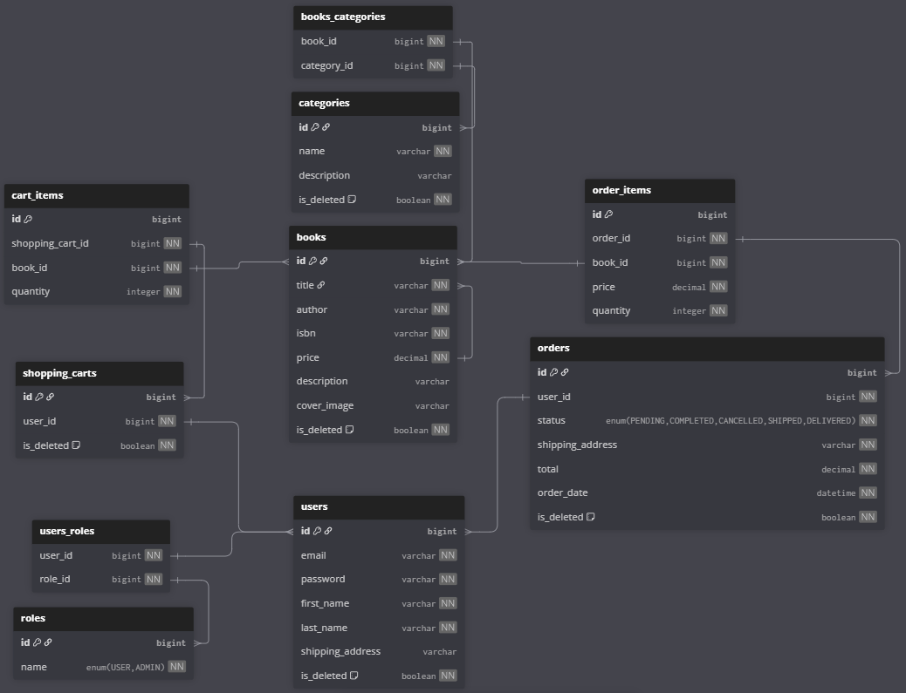

#  Bookstore API

This is a RESTful API for managing a bookstore, supporting CRUD operations for books, categories, users, carts, and orders, as well as user authentication, cart management, and order creation.

##  Features
- **CRUD Operations**: Manage books and categories.
- **Authentication**: User registration and login using JWT.
- **Cart Management**: Add, update, and delete items in the shopping cart.
- **Orders**: Create orders from cart, view orders and items, update status (for admins).
- **Initial Data Seeding**: Automatically creates database schema and initial data via Liquibase.
- **Server-Side Validation**: Ensures data integrity for all operations.
- **Pagination**: Supports paginated lists for books, categories, orders, and items.
- **Roles**: Users (`USER`) and administrators (`ADMIN`) with different access rights.

##  Technologies Used
- **Java 17**
- **Spring Boot**, **Spring Data JPA (Hibernate)**, **Spring Security (JWT)**
- **MapStruct**, **Lombok**
- **MySQL**, **Liquibase**
- **OpenAPI (Swagger)** for API documentation
- **JUnit**, **Mockito** for testing

## Entity Relationship Diagram (ERD)
The following diagram visualizes the core entity relationships in project:


##  Setup Instructions

### Prerequisites
- **Java 17**
- **MySQL** (installed and running)
- **Maven** (optional, as the project includes Maven wrapper)
- **Docker** and **Docker Compose** (optional, for containerized setup)

### Database Configuration
1. Create a MySQL database named `bookstore`.
2. Set environment variables for database credentials:
   ```bash
   export DB_USERNAME=root
   export DB_PASSWORD=qwerty123
   ```
3. Alternatively, update `application.properties` directly:
   ```properties
   spring.datasource.url=jdbc:mysql://localhost:3306/bookstore?createDatabaseIfNotExist=true
   spring.datasource.username=root
   spring.datasource.password=qwerty123
   ```

### Running with Maven
1. Build and run the application:
   ```bash
   ./mvnw clean package
   ./mvnw spring-boot:run
   ```
2. The API will be available at `http://localhost:8080`.

### Running with Docker
1. Ensure Docker and Docker Compose are installed.
2. Build the application:
   ```bash
   ./mvnw clean package
   ```
3. Create a `.env` file in the project root with the following content:
   ```env
   MYSQLDB_USER=root
   MYSQLDB_ROOT_PASSWORD=qwerty123
   MYSQLDB_DATABASE=bookstore
   MYSQLDB_LOCAL_PORT=3306
   MYSQLDB_DOCKER_PORT=3306
   SPRING_LOCAL_PORT=8080
   SPRING_DOCKER_PORT=8080
   DEBUG_PORT=5005
   JWT_EXPIRATION=300000
   JWT_SECRET=secretRow36272294926282948sdsisisidisfkjkdsdhywykaslm
   ```
4. Run the application with Docker Compose:
   ```bash
   docker-compose up --build
   ```
5. The API will be available at `http://localhost:8080`.
6. To stop the application:
   ```bash
   docker-compose down
   ```
7. To remove volumes (including the database):
   ```bash
   docker-compose down -v
   ```

### Notes
- Liquibase automatically creates the database schema and seeds initial data (roles, etc.) on the first run.
- The API documentation is available at `http://localhost:8080/swagger-ui.html`.

##  API Documentation
- **Postman Collection**: Import the Postman collection from `docs/bookstore-api.postman_collection.json` to test the API. Configure the environment variables `base_url` (e.g., `http://localhost:8080`) and `jwt_token` for authentication.

##  Testing
Run unit tests for services (`BookServiceImpl`, `CategoryServiceImpl`, `OrderServiceImpl`, etc.) with:
```bash
./mvnw test
```
